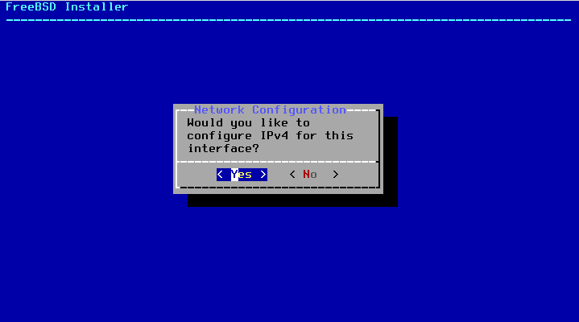
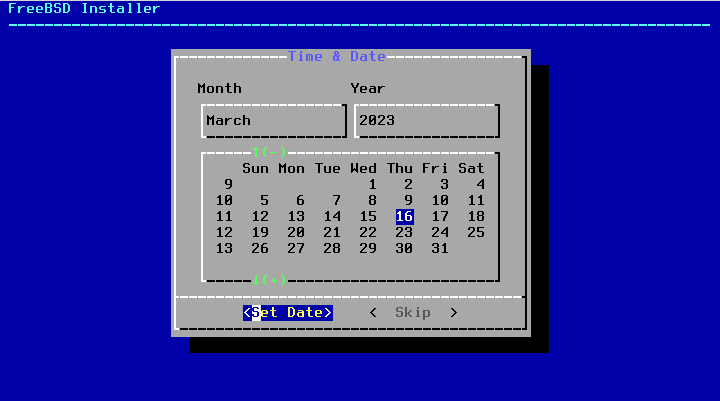

# 0. FreeBSD Installation

Before you install `Hoster`, let me walk you through the FreeBSD installation procedure that is officially supported to smoothly run it on your box.

## TLDR

TLDR for the advanced users. You can stick to your normal installation procedure as long as:

* ZFS is chosen as your default file system
* OS/root ZFS pool name must be kept as `zroot`
* `Unbound` is installed along with the base system

> If you've manually built your FreeBSD kernel, don't forget to include `bhyve` support!

Other than that, everything else can be modified.

## Boot FreeBSD Installation Image

We officially support FreeBSD 13 Release (13.1 and 13.2), and FreeBSD 14 Current
{ loading=lazy }

Hit enter to start the installation
{ loading=lazy }

## First steps

### Keyboard layout

Select your keyboard layout (I'll stick to the US keyboard layout)
{ loading=lazy }

### Hostname

Pick a host name
{ loading=lazy }

### Optional system components

Select optional system components (at least pick what's selected on a screenshot)
{ loading=lazy }

### Network settings

Pick your main network interface
{ loading=lazy }

Assign IPv4 address
{ loading=lazy }

I am using the DHCP here, but you can also pick no and manually assign IPv4 address
{ loading=lazy }

`HosterCore` doesn't yet support IPv6, so I'll skip it for now
{ loading=lazy }

### DNS

Configure DNS
{ loading=lazy }

### ZFS settings

Choose ZFS as your file system
{ loading=lazy }

Pick the correct ZFS settings:

* Pool name must be `zroot`
* I am usually encrypting SWAP and giving it at least 4GB
* Pool type, number of disks involved and so on are not important and you are free to choose whatever works best for you

{ loading=lazy }

I am using `stripe` or `RAID0` in other words for this setup, because it only has one disk
{ loading=lazy }

Mark the disks you'd like to be included in the initial installation
{ loading=lazy }

Confirm that you are happy with the storage setup so far
{ loading=lazy }

### Download and extract the missing parts

I am using a small installation image, and now it's required to pick an online mirror to grab the missing packages
{ loading=lazy }

Wait just a couple of minutes for the installer to download and extract the required stuff
{ loading=lazy }
{ loading=lazy }

### Root password

Assign a `root` password
{ loading=lazy }

### Timezone settings

Pick a time zone
{ loading=lazy }
{ loading=lazy }
{ loading=lazy }
{ loading=lazy }

### Additional packages

Install additional packages (please select all things, like you see in the screenshot)
{ loading=lazy }

### System hardening

System hardening (I am usually selecting all of the below)
{ loading=lazy }

### Add more users

`HosterCore` requires `root` user, so I don't bother with adding users on private nodes. Plus you can always add more users later.
{ loading=lazy }

### Finish the installation

Finish the installation and reboot the system
{ loading=lazy }
{ loading=lazy }
{ loading=lazy }

## Final touches

### Log in

{ loading=lazy }

### Install your favourite text editor

My favourite text editor is `micro`, that's why I am gonna install and use it here
{ loading=lazy }
{ loading=lazy }
{ loading=lazy }

### Edit SSH config

I want to enable remote `root` SSH login, because it's the only available account on this system right now
{ loading=lazy }

Find a line 36 (or close to that), which should say `PermitRootLogin`, change from `no` to `yes` and uncomment it
{ loading=lazy }
{ loading=lazy }

### Restart SSH

Now we simply need to restart the SSHD service, and we'll be ready to move on to the next step: `HosterCore` installation
{ loading=lazy }
