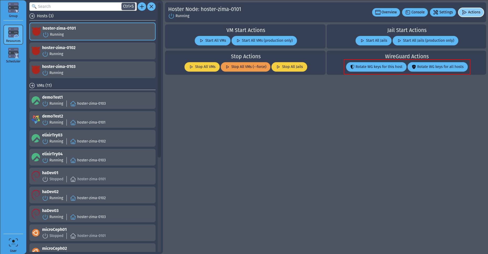

# WireGuard Mesh

## Introduction

Since the release of `Hoster Command Center` we've got the ability to automatically generate the meshed WireGuard configurations. The configuration itself is not yet exposed in the WebUI, but you can manually edit the JSON config file, like so:

{ loading=lazy }

Then go back to the WebUI and press one of the two buttons:

{ loading=lazy }

The one on the left will (re)generate the config for this particular host only, and will make sure it can communicate with every other host in the group.
There is really a limited use case for this button: rotating single host keys if they get exposed.

Button on the right makes the magic happen: it helps you generate WG mesh for the whole host group.
After pressing that button every single host in our group will be able to talk to every other host using a full mesh topology.
On top of that you can expose the internal networks on any (or all?) node you want, making it a full-blown SDN configuration.

Mesh of 4 hosts looks like this:
{ loading=lazy }

And now have a look at the mesh of 6 hosts:
{ loading=lazy }

Number of interface links equals to the number of hosts - 1. E.g. if you've got 4 hosts in the group the generator will create 3 interfaces.

You may need to play with the PF configuration to allow the network packets to go through (if PF is enabled), but at this point any VM/Jail should be able to access any other VM/Jail within this group of hosts (even the ones on the "internal" networks).

## Use Cases

There are many use cases for this technology, but I'll point out the few that come to mind immediately.

### Monitoring

If you use Zabbix or Prometheus to monitor your Hoster infrastructure then you might be tired of exposing ports, and playing with firewall rules to get everything right. With full mesh WG you don't need to do any of that, and as a bonus all your monitoring related network packets are encrypted while flying over the wire.

### Interconnecting Nodes In Different Locations

From now on you wouldn't have to manage your site-to-site VPN connections by hand for the nodes located in different data centers or even cities/countries.

### SDN Mesh

WireGuard mesh allows your VMs and Jails to communicate freely even if they are located on different hosts.

### Management Traffic Encryption

HTTP management traffic between the Hoster nodes (or between the Control Center and Hoster nodes) is unencrypted by default.
So unless you are willing to generate and renew the SSL keys by hand - simply enable the WG mesh VPN and enjoy the low-config HTTP encryption with zero compromise.

> If you are wondering - I am working on the automated SSL encryption/management, but it's not ready yet.
